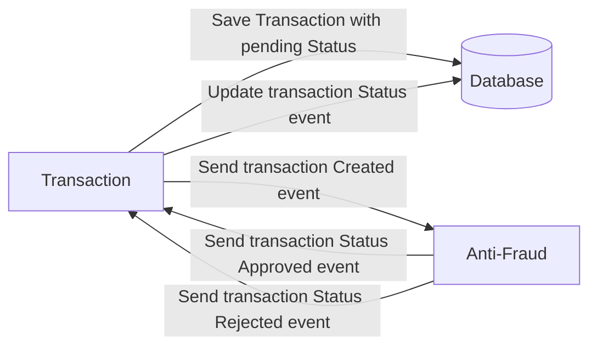

# Yape Code Challenge :rocket:

Our code challenge will let you marvel us with your Jedi coding skills :smile:. 

Don't forget that the proper way to submit your work is to fork the repo and create a PR :wink: ... have fun !!

- [Problem](#problem)
- [Tech Stack](#tech_stack)
- [Send us your challenge](#send_us_your_challenge)

# Problem

Every time a financial transaction is created it must be validated by our anti-fraud microservice and then the same service sends a message back to update the transaction status.
For now, we have only three transaction statuses:

<ol>
  <li>pending</li>
  <li>approved</li>
  <li>rejected</li>  
</ol>

Every transaction with a value greater than 1000 should be rejected.



# Tech Stack

Esta implementación tiene:

<ol>
  <li><strong>Java 21</strong> - Aprovechando Virtual Threads y Records</li>
  <li><strong>Spring Boot 3.4.1</strong> - Framework base para los microservicios</li>
  <li><strong>PostgreSQL</strong> - Base de datos principal con CDC habilitado</li>
  <li><strong>Redis</strong> - Cache para lecturas de alto volumen</li>
  <li><strong>Kafka + Debezium</strong> - Event Streaming y CDC</li>
  <li><strong>Spring Cloud Stream</strong> - Comunicación con Kafka</li>
  <li><strong>Flyway</strong> - Migraciones de base de datos</li>
</ol>

## 🏗️ Arquitectura de Microservicios

El proyecto está organizado en 3 microservicios siguiendo :

### 1. **ms-ux-orchestrator** (Puerto: 8080)
- **Rol**: Backend for Frontend (BFF)
- **Tecnologías**: Spring WebFlux, WebClient
- **Responsabilidad**: API Gateway, validaciones y orquestación

### 2. **ms-ne-transaction-service** (Puerto: 8081)
- **Rol**: Core de Negocio
- **Tecnologías**: Spring Data JPA, PostgreSQL, Redis, Kafka Consumer
- **Responsabilidad**: Gestión de transacciones y persistencia
- **Patrones**: Transactional Outbox implementado con CDC

### 3. **ms-sp-antifraud-rules** (Puerto: 8082)
- **Rol**: Motor de Reglas Especializadas
- **Tecnologías**: Kafka Streams, Spring Cloud Stream
- **Responsabilidad**: Validación anti-fraude en tiempo real
- **Patrones**: Event Streaming, Chain of Responsibility

## 📦 Estructura del Proyecto

```
app-nodejs-codechallenge/
├── ms-ux-orchestrator/          # BFF - API Gateway
├── ms-ne-transaction-service/   # Servicio Core de Transacciones
├── ms-sp-antifraud-rules/       # Motor de Reglas Anti-Fraude
├── settings.gradle              # Configuración multi-proyecto
├── build-all.sh                 # Script de compilación (Linux/Mac)
├── build-all.bat                # Script de compilación (Windows)
└── docker-compose.yml           # Orquestación de servicios
```

Cada microservicio sigue la estructura de **Arquitectura Hexagonal**:
- `controller/` - Adaptadores de entrada (REST)
- `service/` - Casos de uso (Application Layer)
- `model/` - Dominio (domain, entity, port)
- `repository/` - Adaptadores de salida (Persistencia)
- `application/config/` - Configuración
- `application/exception/` - Manejo de errores

## 🚀 Cómo Ejecutar

### Pre-requisitos
- Java 21 JDK zulu
- Gradle 8.x (aca falta incluir la varsionc on el wrapper para que funcione siempre)
- Docker & Docker Compose


You must have two resources:

1. Resource to create a transaction that must containt:

```json
{
  "accountExternalIdDebit": "Guid",
  "accountExternalIdCredit": "Guid",
  "tranferTypeId": 1,
  "value": 120
}
```

2. Resource to retrieve a transaction

```json
{
  "transactionExternalId": "Guid",
  "transactionType": {
    "name": ""
  },
  "transactionStatus": {
    "name": ""
  },
  "value": 120,
  "createdAt": "Date"
}
```

## Optional

You can use any approach to store transaction data but you should consider that we may deal with high volume scenarios where we have a huge amount of writes and reads for the same data at the same time. How would you tackle this requirement?

You can use Graphql;

# Send us your challenge

When you finish your challenge, after forking a repository, you **must** open a pull request to our repository. There are no limitations to the implementation, you can follow the programming paradigm, modularization, and style that you feel is the most appropriate solution.

If you have any questions, please let us know.
