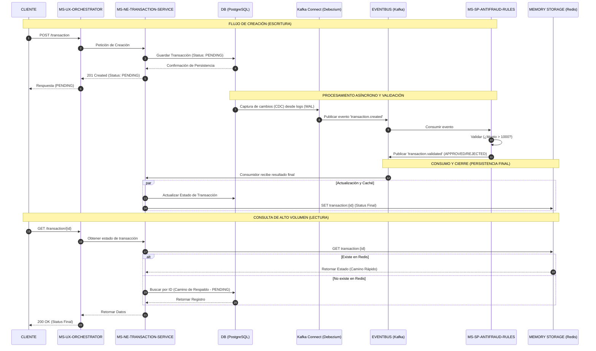
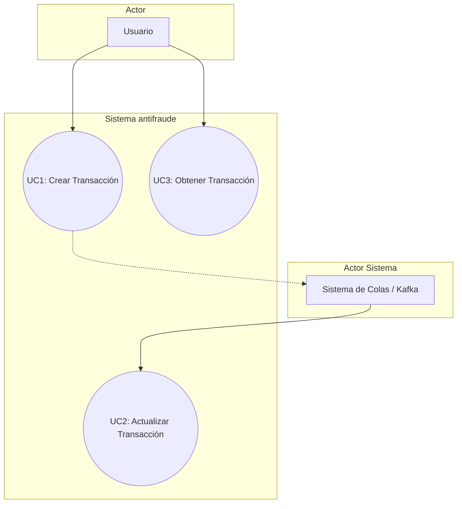

# Yape Code Challenge - Guia de Ejecucion :rocket:

## Análisis y Diseño de la Solución

### Diagrama de Secuencia



### Diagrama de Casos de Uso



#### Descripción de Casos de Uso

**UC1 - Crear Transacción**
- **Actor Principal:** Cliente
- **Descripción:** Permite crear una nueva transacción financiera con estado inicial PENDING
- **Flujo Principal:**
  1. Cliente envía datos de transacción (cuentas débito/crédito, tipo, monto)
  2. Sistema valida los datos de entrada
  3. Sistema persiste transacción en PostgreSQL con estado PENDING
  4. Sistema responde con ID de transacción y estado PENDING
  5. CDC captura el cambio y lo envía a Kafka para validación asíncrona

**UC2 - Actualizar Transacción**
- **Actor Principal:** Antifraud Service (Sistema)
- **Descripción:** Actualiza el estado de una transacción basado en validación de riesgos
- **Flujo Principal:**
  1. Antifraud Service consume evento de transacción creada
  2. Sistema valida reglas de negocio (monto > 1000)
  3. Sistema determina estado (APPROVED/REJECTED)
  4. Sistema publica resultado en Kafka
  5. Transaction Service consume resultado
  6. Sistema actualiza PostgreSQL y Redis

**UC3 - Obtener Transacción**
- **Actor Principal:** Cliente
- **Descripción:** Permite consultar el estado actual de una transacción por ID
- **Flujo Principal:**
  1. Cliente solicita transacción por ID
  2. Sistema busca en Redis (cache)
  3. Si existe en cache, retorna inmediatamente
  4. Si no existe, busca en PostgreSQL
  5. Sistema actualiza cache con resultado de BD
  6. Sistema responde con datos de transacción

## Arquitectura y Patrones

### Arquitectura Hexagonal (Ports & Adapters)

Cada microservicio implementa arquitectura hexagonal para lograr:

- **Separación de Responsabilidades:** Dominio desacoplado de infraestructura
- **Testabilidad:** Lógica de negocio independiente de frameworks
- **Flexibilidad:** Fácil cambio de tecnologías sin afectar el core

```
┌────────────────────────────────────────────────────────────┐
│                     APPLICATION LAYER                       │
│  ┌──────────────────────────────────────────────────────┐  │
│  │         Controllers / REST Endpoints                 │  │
│  │         (Entry Point - Adapters)                    │  │
│  └────────────────┬─────────────────────────────────────┘  │
│                   │                                          │
│  ┌────────────────▼─────────────────────────────────────┐  │
│  │              SERVICE LAYER (Ports)                   │  │
│  │  ┌────────────────────────────────────────────────┐ │  │
│  │  │         Use Cases (Business Logic)             │ │  │
│  │  │  - CreateTransactionUseCase                    │ │  │
│  │  │  - GetTransactionUseCase                       │ │  │
│  │  │  - UpdateTransactionStatusUseCase              │ │  │
│  │  └────────────────────────────────────────────────┘ │  │
│  └────────────────┬─────────────────────────────────────┘  │
│                   │                                          │
│  ┌────────────────▼─────────────────────────────────────┐  │
│  │              DOMAIN LAYER (Core)                     │  │
│  │  ┌────────────────────────────────────────────────┐ │  │
│  │  │  Entities, Value Objects, Domain Services      │ │  │
│  │  │  - Transaction (Aggregate Root)                │ │  │
│  │  │  - TransactionStatus (Enum)                    │ │  │
│  │  │  - TransactionType (Value Object)              │ │  │
│  │  └────────────────────────────────────────────────┘ │  │
│  └────────────────┬─────────────────────────────────────┘  │
│                   │                                          │
│  ┌────────────────▼─────────────────────────────────────┐  │
│  │         INFRASTRUCTURE LAYER (Adapters)              │  │
│  │  ┌───────────────┐  ┌──────────────┐  ┌──────────┐ │  │
│  │  │  JPA Repos    │  │  Redis Cache │  │  Kafka   │ │  │
│  │  │  (PostgreSQL) │  │  Adapter     │  │  Consumer│ │  │
│  │  └───────────────┘  └──────────────┘  └──────────┘ │  │
│  └──────────────────────────────────────────────────────┘  │
└────────────────────────────────────────────────────────────┘
```

### Patrones Implementados

#### 1. **Event-Driven Architecture (EDA)**
- Comunicación asíncrona entre microservicios vía Kafka
- Desacoplamiento temporal y espacial
- Escalabilidad independiente de componentes

#### 2. **Change Data Capture (CDC)**
- Debezium captura cambios en PostgreSQL sin tocar código
- Transactional Outbox Pattern implícito
- Garantía de entrega de eventos

#### 3. **CQRS (Command Query Responsibility Segregation)**
- **Command:** Creación de transacciones → PostgreSQL
- **Query:** Consulta de transacciones → Redis (cache) + PostgreSQL (fallback)
- Optimización de lecturas de alto volumen

#### 4. **Cache-Aside Pattern**
- Redis actúa como cache de lectura
- Actualización lazy: solo cuando no existe en cache
- TTL configurado para evitar datos obsoletos

#### 5. **Saga Pattern (Orquestación)**
- Orquestador coordina flujo entre servicios
- Manejo de transacciones distribuidas
- Rollback compensatorio en caso de fallo

#### 6. **Repository Pattern**
- Abstracción de acceso a datos
- Interfaces (Ports) en capa de dominio
- Implementaciones (Adapters) en infraestructura

#### 7. **API Gateway Pattern**
- MS-UX-Orchestrator actúa como punto único de entrada
- Composición de respuestas de múltiples servicios
- Circuit Breaker y Timeout configurados

## Tecnologías Usadas

### Backend Framework & Language

| Tecnología | Versión | Uso |
|------------|---------|-----|
| **Java** | 21 (LTS) | Lenguaje principal con Pattern Matching, Records, Switch Expressions |
| **Spring Boot** | 3.4.1 | Framework de microservicios |
| **Spring WebFlux** | 3.4.1 | Programación reactiva (Orchestrator) |
| **Spring Data JPA** | 3.4.1 | ORM para PostgreSQL |
| **Spring Cloud Stream** | 4.2.0 | Integración con Kafka |
| **Spring Kafka** | 3.3.0 | Consumer/Producer de Kafka |
| **Gradle** | 8.5 | Gestión de dependencias y build |

### Persistencia & Cache

| Tecnología | Versión | Uso |
|------------|---------|-----|
| **PostgreSQL** | 16 | Base de datos relacional principal |
| **Flyway** | 10.x | Migraciones de base de datos |
| **Redis** | 7.2 | Cache in-memory para lecturas de alto volumen |

### Event Streaming & CDC

| Tecnología | Versión | Uso |
|------------|---------|-----|
| **Apache Kafka** | 3.6.x | Event Bus para comunicación asíncrona |
| **Debezium** | 2.4.2 | Change Data Capture desde PostgreSQL |
| **Kafka Connect** | 7.5.0 | Plataforma de conectores (Confluent) |
| **Confluent Control Center** | 7.5.0 | Monitoreo de Kafka |

### Containerización & Orquestación

| Tecnología | Versión | Uso |
|------------|---------|-----|
| **Docker** | 24.x | Containerización de aplicaciones |
| **Docker Compose** | 2.x | Orquestación local multi-container |
| **Alpine Linux** | 3.x | Imágenes base ligeras |


## Ejecución Completa con Un Solo Comando

```bash
docker-compose up -d --build
```

Este comando ejecutará automáticamente:

1. ✅ **Compilación de proyectos Gradle**
   - Transaction Service (con Flyway migrations)
   - Orchestrator Service
   - Antifraud Service

2. ✅ **Levantamiento de toda la infraestructura**
   - PostgreSQL con CDC habilitado
   - Redis
   - Kafka + Zookeeper
   - Kafka Connect con Debezium
   - Control Center
   - 3 Microservicios

## Orden de Inicio

```
1. postgres, redis, zookeeper
2. kafka
3. transaction-service (ejecuta migraciones Flyway)
4. orchestrator-service
5. antifraud-service
6. connect (Debezium CDC - registra conector automáticamente)
7. control-center
```

## Verificar que Todo Funciona

### 1. Ver logs de compilación
```bash
docker-compose logs -f antifraud-service
```

### 2. Verificar servicios activos
```bash
docker-compose ps
```

### 3. Health checks
```bash
curl http://localhost:9992/actuator/health
curl http://localhost:9991/actuator/health
curl http://localhost:9993/actuator/health
```

### 4. Verificar conector Debezium
```bash
curl http://localhost:8083/connectors/yape-transaction-connector/status
```

### 5. Verificar tópicos de Kafka
```bash
docker exec -it yape-kafka kafka-topics --bootstrap-server localhost:9092 --list
```

## Probar el Flujo Completo

### 1. Crear una transacción
```bash
curl -X POST http://localhost:9991/transaction \
  -H "Content-Type: application/json" \
  -d '{
    "accountExternalIdDebit": "550e1234-e29b-41d4-a716-446655445556",
    "accountExternalIdCredit": "661f9321-f30c-52e5-b827-557766551111",
    "tranferTypeId": 1,
    "value": 1050.50
  }'
```

### 2. Consultar estado (transactionExternalId es obtenido de la respuesta de crear transaccion)
```bash
curl curl -X GET http://localhost:9991/transaction/{transactionExternalId} \
     -H "Accept: application/json" \
     -H "Content-Type: application/json"
```

### 3. Ver eventos en Kafka
```bash
docker exec -it yape-kafka kafka-console-consumer \
  --bootstrap-server localhost:9092 \
  --topic yape.public.transactions \
  --from-beginning

docker exec -it yape-kafka kafka-console-consumer \
  --bootstrap-server localhost:9092 \
  --topic transaction.validated \
  --from-beginning
```


## Puertos Expuestos

| Servicio | Puerto | URL |
|----------|--------|-----|
| PostgreSQL | 5432 | jdbc:postgresql://localhost:5432/yape_db |
| Redis | 6379 | localhost:6379 |
| Kafka | 9092 | localhost:9092 |
| Kafka Connect | 8083 | http://localhost:8083 |
| Control Center | 9021 | http://localhost:9021 |
| Transaction Service | 9992 | http://localhost:9992 |
| Orchestrator | 9991 | http://localhost:9991 |
| Antifraud | 9993 | http://localhost:9993 |

## Comandos Útiles

### Reconstruir todo desde cero
```bash
docker-compose down -v
docker-compose up -d --build
```

### Ver logs en tiempo real
```bash
docker-compose logs -f

docker-compose logs -f antifraud-service
docker-compose logs -f transaction-service
docker-compose logs -f connect
```


### Detener y eliminar volúmenes (datos)
```bash
docker-compose down -v
```


## Notas Importantes

- ⚠️ La primera compilación tardará más (descarga dependencias)
- ⚠️ Transaction Service ejecuta Flyway migrations automáticamente
- ⚠️ Debezium registra el conector automáticamente al iniciar
- ⚠️ Las transacciones se crean con estado PENDING y se actualizan asíncronamente
- ⚠️ Redis actúa como cache, PostgreSQL es la fuente de verdad

## Arquitectura Multi-Stage Build

```
┌─────────────────────────────────────┐
│  Stage 1: Builder (JDK + Gradle)    │
│  - Copia código fuente              │
│  - Ejecuta gradle clean build       │
│  - Ejecuta tests                    │
│  - Crea JAR ejecutable              │
└──────────────┬──────────────────────┘
               │
               ▼
┌─────────────────────────────────────┐
│  Stage 2: Runtime (JRE Alpine)      │
│  - Copia solo el JAR                │
│  - Instala curl (healthchecks)      │
│  - Imagen ligera (~150MB)           │
│  - Lista para ejecutar              │
└─────────────────────────────────────┘
```

**Ventajas:**
- ✅ No necesitas tener Java ni Gradle instalados localmente
- ✅ Build reproducible en cualquier entorno
- ✅ Imágenes finales más pequeñas (solo JRE, no JDK)
- ✅ Todo se compila dentro de Docker de forma aislada

